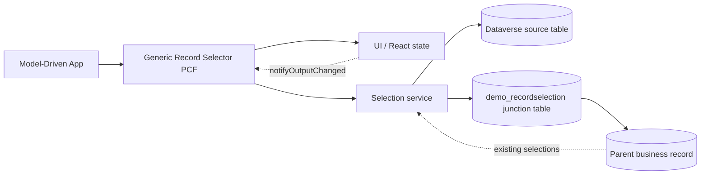
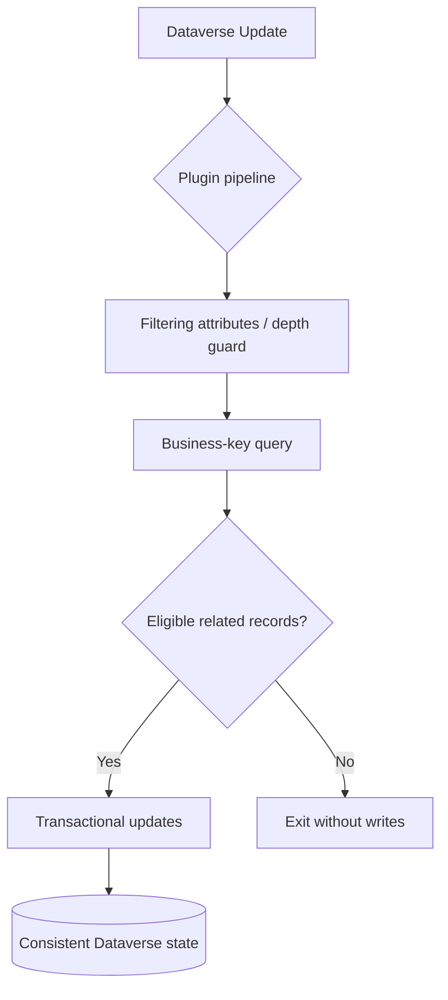
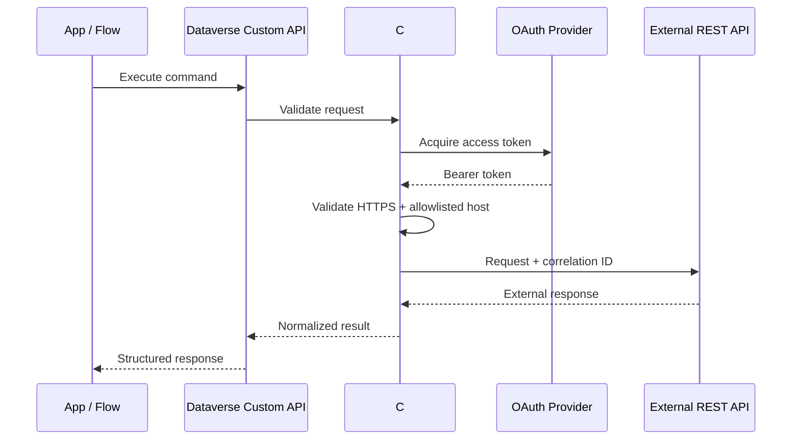
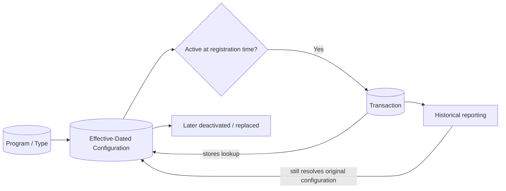
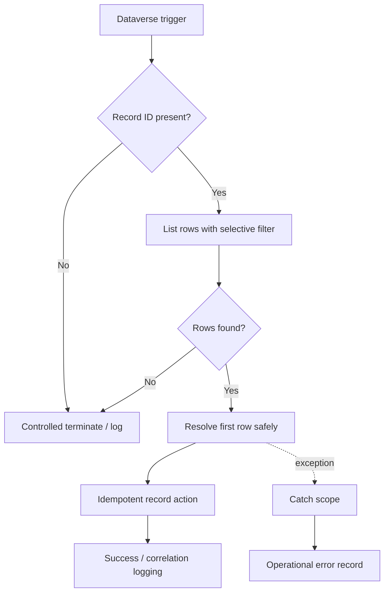
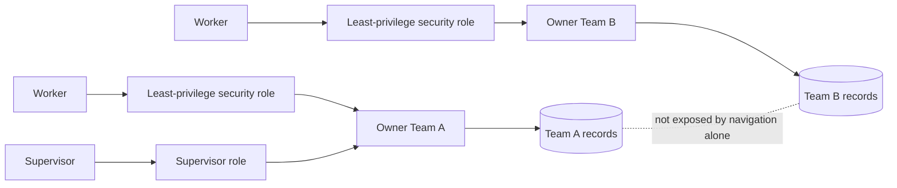
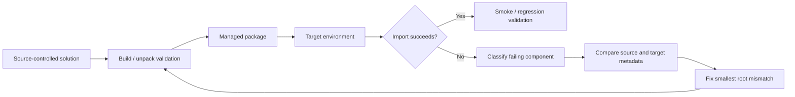
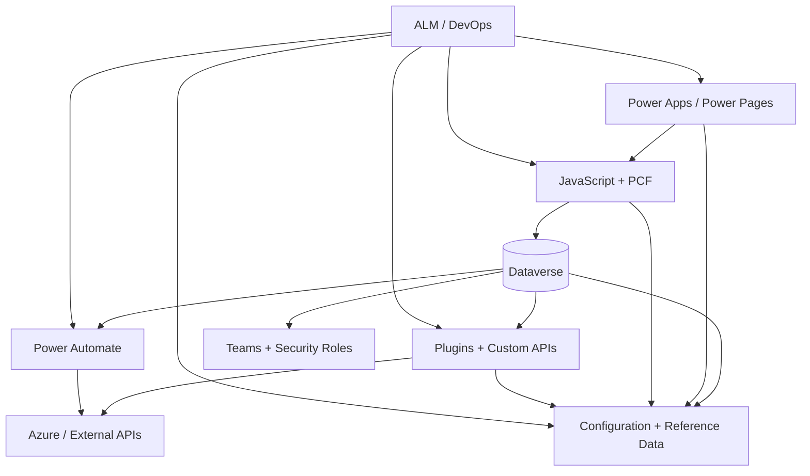

# Power Platform Architecture Atlas

This page gives a visual map of the flagship engineering patterns in this repository. The diagrams are intentionally generic and use sanitized `demo_` concepts rather than organization-specific systems.

## 1. Reusable PCF selection architecture

**Key idea:** keep rendering, Dataverse access, and persistence concerns separate. Persist multi-record selections explicitly when history, reporting, and relationship semantics matter.

[Open the Generic Record Selector PCF →](../pcf/generic-record-selector-pcf/)

---

## 2. Server-side consistency architecture

**Key idea:** business rules that must hold regardless of client belong on the server. The plugin limits reads/writes and prevents recursive synchronization.

[Open the Cross-Record Synchronization Plugin →](../plugins/cross-record-synchronization-plugin/)

---

## 3. Secure external service gateway

**Key idea:** credentials and endpoint trust decisions remain server-side. Client applications receive a stable command contract rather than direct access to protected services.

[Open Secure Service Integration →](../custom-api/secure-service-integration/)

---

## 4. Effective-dated configuration and historical context

**Key idea:** a transaction keeps the configuration record that was valid when the transaction was created. Later configuration changes do not rewrite historical meaning.

[Open Effective-Dated Configuration →](../dataverse/effective-dated-configuration/)

---

## 5. Defensive Power Automate execution

**Key idea:** never dereference `first()` or invoke a record action until the identifier/result has been validated.

[Open Defensive Dataverse Record ID Handling →](../power-automate/defensive-dataverse-recordid-flow/)

---

## 6. Team-based Dataverse security boundary

**Key idea:** Model-Driven App navigation can improve UX, but the actual data boundary is Dataverse privileges, ownership, business units, teams, and sharing.

[Open Team-Based Data Security →](../security/team-based-data-security/)

---

## 7. Managed delivery and troubleshooting loop

**Key idea:** solve the metadata mismatch at its source rather than layering workarounds on the target environment.

[Open Solution Import Troubleshooting →](../alm/solution-import-troubleshooting/)

---

## How the patterns fit together

The repository is organized around these boundaries so each pattern can be reviewed independently while still fitting into a larger enterprise solution architecture.
